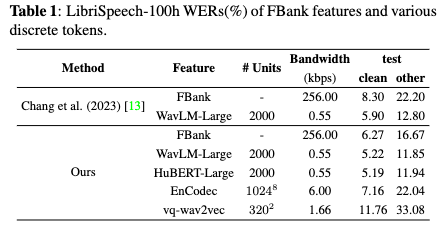

1. 

   ## 离散token用于多语言的识别的方法

   ### 1.论文

   * Towards Universal Speech Discrete Tokens: A Case Study for ASR and TTS

     > (Shanghai Jiao Tong University & Xiaomi; Yifan Yang, Feiyu Shen, Chenpeng Du, Ziyang Ma, Kai Yu, Daniel Povey, Xie Chen; ICASSP 2024 )

     

     1. 任务： ASR & TTS

     2. 实验语言： 英语 ➕ 中文

     3. 数据集：LibriSpeech , GigaSpeech , and AISHELL-1 corpora

     4. audio tokenizers：

        * WavLM-Large
        * HuBERT-Large
        * EnCodec
        * vq-wav2vec

     5. 整体框架：离散化特征提取 -》 ASR模型

     6. ASR模型选择：neural Transducer architecture with Zipformer encoder（K2）

     7. 实验结果：

        * 实验1: 低资源LibriSpeech 的结果：使用不同类型的离散标记在 Lib-riSpeech100h 上训练的模型的 ASR 性能。使用 FBank 测试清洁和测试其他功能训练的系统相比，使用 WavLM 和 HuBERT 代币训练的系统分别提高了 17% 和 28%。从 Encodec 和 vq-wav̖vec 派生的离散令牌 的性能比 FBankfeatures 差。这揭示了 SSL 模型对于 离散令牌生成的重要性以及来自 WavLM 和 HuBERT 模 型的离散令牌在低资源数据上的优越性。

          

        * 实验2: 全量数据Librispeech结果：使用不同类型的离散标记在 LibriSpeech960h 上训练的模型的 ASR 性能。使用 WavLM 和 HuBERT large 进行训练的系统显示出与基于 FBank 的系统相比具有竞争力的性能。与表 1 中所示的 Librispeech 100 h 的观察类似，来自 Encodec 和 vq-wav̖vec 的离散标记始终比来自 HuBERT 和 WavLM 模型的离散标记更差。

          > 解释：HuBERT 和 WavLM 的特征是从顶层 Transformer 层提取的，其中包含更多语义信息。还值得注意的是，离 散令牌在测试干净集上产生的 WER 结果与连续 FBank 特征相当。但相比之下，在其他测试中观察到相对较大的 WER 差距。一个可能的原因是离散标记擅长在干净的条 件下提取语义信息，但仍然无法胜任复杂的声学条件。

          

          

        * 实验3:泛化实验：Gigaspeech 中从 WavLM 提取 的离散令牌始终优于 HuBERT 的离散令牌。 WavLM 的 离散token落后于连续 FBank 功能。Mandarin AISHELL 数据集中，离散标记的 WER 结果比 FBank 特征差得多。 

          > Mandarin AISHELL 数据集中，离散标记的 WER 结果比 FBank 特征差得多。 回想一下，用于提取离散标记的 SSL 模型是在英语语料库中训练的，当前离散标记跨语言的泛化能力还有待改进。

           

   * Children’s Speech Recognition through Discrete Token Enhancement

     > (卡塔尔计算研究所 Qatar Computing Research Institute; Vrunda N. Sukhadia, Shammur Absar Chowdhury; Interspeech 2024 ) 

     

     1. 实验语言：英语

     2. 整体框架：离散化特征提取 -》 ASR模型

     3. 离散化特征提取：预训练的Hubert 和 WavLM + K-means聚类（2000units，需要训练）

     4. ASR模型选择：E-Branchformer encoder and Transformer decoder architecture （ESPnet实验）

     5. 实验结果：

        * 实验一：传统输入与离散输入: 离散令牌的性能与 HuBERT 和 WavLM 端到端模型相当，性能略有下降。与 Whisper 模型相比仍有差距。

          

        * 实验二：单模型和多模型 : 单视图设置中，WavLM 离散令牌的性能比 HuBERT 离散令牌好。（假设 WavLM 模型嵌入由于其添加的话语混合策略 而更加稳健，可以更有效地解决儿童语音的可变性。）对于多视图设置，D (MV) 的性能优于 HuBERT-D (S) 模型。然而，WavLM-D (S) 仍然优于这两种变体。（选择稳健的 SSL 模型对于利用多 视图离散令牌的力量至关重要。）

        * 实验三：泛化能力：WavLM-D (S) 优于所有其他离散 ASR 系统，并且还提供了与零样本 Whisper 模型相当的结 果。

          

        * 实验三：误差分析： 探究添加噪声对模型性能的影响。由于所有离散 ASR 中存在不同的错误，多视图离散 ASR 更接近转录的逐字形式。

          

   * DASB - Discrete Audio and Speech Benchmark （[speechbrain Benchmark]([benchmarks/benchmarks/DASB at main · speechbrain/benchmarks (github.com)](https://github.com/speechbrain/benchmarks/tree/main/benchmarks/DASB))）

     > (康考迪亚大学,加拿大; Pooneh Mousavi;arXiv:2406.14294)

     > Github: DASB - Discrete Audio and Speech Benchmark
     >
     > This repository provides a benchmark for evaluating discrete audio representations using popular audio tokenizers like **EnCodec**, **DAC**, and many more, integrated with SpeechBrain.
     >
     > The package helps integrate and evaluate new audio tokenizers in speech tasks of great interest such as *speech recognition*, *speaker identification*, *emotion recognition*, *keyword spotting*, *intent classification*, *speech enhancement*, *separation*, and *text-to-speech*. It offers an interface for easy model integration and testing and a protocol for comparing different audio tokenizers.
     >
     > This repository can be used to benchmark new audio tokenizers reliably. It includes a benchmark on 9 audio and speech datasets using 6 popular discrete audio encoders: **semantic** (*Discrete HuBERT*, *Discrete WavLM*, *Discrete Wav2Vec2*), **compression** (*EnCodec*, *DAC*), and **hybrid** (*SpeechTokenizer*). We consider different downstream architectures for each task and report the best-performing architecture.

     

     1. 实验语言：LibriSpeech 英语； CommonVoice 17.0 中威尔士语 (Cymraeg) 和巴斯克语 (Euskera) 

        > 分别在train-clean100和dev-clean子集上进行训练和验证，同时在test-clean和 test-other子集上进行测试。

     2. speechbrain 的 BiLSTM 架构 和 ContextNet架构

     3. 实验结果：对于大多数判别任务，语义标记明显优于压缩标记。这种趋势是由于语义标记能够从音频信号中捕获高级信息，唯一的例外是说话人识别任务， EnCodec 在该任务中取得了最佳结果。这表明压缩令牌可以更好地编码说话者信息。

        

   * dMel: Speech Tokenization made Simple

     > (Apple; He Bai,Tatiana Likhomanenko;arXiv:2407.15835)

     

     

   * SpeechGPT: Empowering Large Language Models with Intrinsic Cross-Modal Conversational Abilities

     > Fudan University; Dong Zhang, Xin Zhang, Jun Zhan, Shimin Li, Yaqian Zhou, Xipeng Qiu; EMNLP2023 Findings

   * SpeechGPT-Gen: Scaling Chain-of-Information Speech Generation

     > Fudan University; Dong Zhang, Xin Zhang, Jun Zhan, Shimin Li, Yaqian Zhou, Xipeng Qiu; arXiv: 2401.13527

   * SpeechTokenizer: Unified Speech Tokenizer for Speech Language Models

     > Fudan University; Xin Zhang, Dong Zhang, Shimin Li, Yaqian Zhou, Xipeng Qiu; ICLR 2024

   * WavTokenizer: an Efficient Acoustic Discrete Codec Tokenizer for Audio Language Modeling

     > Zhejiang University & Alibaba Group & Fundamental AI Research (FAIR), Meta; Shengpeng Ji, Ziyue Jiang, Xize Cheng, Yifu Chen, Minghui Fang, Jialong Zuo, Qian Yang, Ruiqi Li, Ziang Zhang, Xiaoda Yang, Rongjie Huang, Yidi Jiang, Qian Chen, Siqi Zheng, Wen Wang, Zhou Zhao; arXiv:2408.16532

     

     > 所以相当于1个token 10bit ，然后对应的就是每个码本数量是1024，10位～，那100token/s代表的就是每一秒有100个采样点。
     >
     > 如果使用两个码本的话，**100 token/s** 仍然表示每秒有 100 个 token，但每个 token 可以通过组合两个码本中的条目来表示，从而增加了表达能力。
     >
     > **一个码本**：
     >
     > - 每个 token 对应一个码本，假设这个码本有 1024 个条目（10 bit 表示）。
     > - 每秒 100 token，表示每秒有 100 个采样点，每个采样点用一个 10 bit 的条目表示。
     >
     > **两个码本**：
     >
     > - 当使用两个码本时，每个 token 实际上是通过两个码本的组合来表示。
     > - 假设每个码本也有 1024 个条目（10 bit），那么两个码本的组合可以表示 1024×1024=2201024 \times 1024 = 2^{20}1024×1024=220 个不同的条目，这相当于每个 token 用 20 bit 来表示（因为 210×210=2202^{10} \times 2^{10} = 2^{20}210×210=220）。

   ### 2. Metric

   > compression, reconstruction quality, and semantic modeling

   * Compression: the number of quantizers and the temporal dimension of the codec. 【low bitrates】

     > - **多量化器下的下游模型设计**：当量化器数量多于一个时，下游模型如 Valle、SoundStorm、MusicGen 和 UniAudio 等分别采用不同的特殊结构设计，包括 AR 和 NAR 结构、并行生成、倾斜自回归结构以及全局和局部注意力结构等。
     > - **单量化器的优势**：单个量化器可使语音模态直接自回归地嵌入到大型多模态模型中，相对更简洁高效。
     > - **编解码器时间维度的影响**：编解码器的时间维度，以 DAC 为例每秒需 900 个标记，会对语言模型的生成质量和资源消耗产生影响。

     | Feature      | # Units | # Frame Rate      |                               | Bandwidth (kbps) |
     | ------------ | ------- | ----------------- | ----------------------------- | ---------------- |
     | FBank        | -       | 100 帧 (帧移10ms) | 32 bit * 80 * 100 = 256 000   | 256.00           |
     | WavLM-Large  | 2000    | 50 Hz             |                               | 0.55             |
     | HuBERT-Large | 2000    | 50 Hz             |                               | 0.55             |
     | EnCodec      | 1024^8  | 75 Hz embeddings  | 10位(bit) * 8组 * 75Hz = 6000 | 6.00             |
     | vq-wav2vec   | 320^2   | 100 Hz embeddings |                               | 1.66             |

   * Pursuing Better Reconstruction Quality

     > AudioDec, PromptCodec, DAC, HiFi-Codec, APCodec, Single-Codec, Language-Codec

   ### 3. Speech discrete tokens

   #### 3.1 semantic tokens

   > vq-wav2vec, wav2vec 2.0, HuBERT, and WavLM (Discrete HuBERT, Discrete WavLM, Discrete Wav2Vec2)

   * vq-wav2vec employs autoregressive Convolutional Neural Networks(CNNs) to extract feature representations from raw audio, which are then organized into multiple groups. Subsequently, vector quantization is applied in each group, facilitated by either the Gumbel-Softmax or online k-means clustering, yielding multiple sets of discrete token sequences. In practice, a pre-trained vq-wav2vec model is employed to process 16 kHz audio and outputs embeddings at a 100 Hz rate with 2 groups.
   * For wav2vec 2.0, HuBERT, and WavLM, the discretization of speech can be realized by applying k-means clustering to the hidden embeddings from some specified Transformer-Encoder layer.

   ##### 3.1.1 CPC: Representation Learning with Contrastive Predictive Coding

   > [基于判别学习的语音预训练模型（2-1）---CPC from DeepMind - 知乎 (zhihu.com)](https://zhuanlan.zhihu.com/p/463867673)
   >
   > 作者通过训练一个线性分类器来验证CPC提取的特征中包含的音素。

   

   

   ##### 3.1.2 wav2vec: Unsupervised Pre-training for Speech Recognition

   > 不同于CPC文章中作者只训练一个线性层来评估预训练特征向量中包含的语义信息，wav2vec的作者们**将预训练的wav2vec模型作为特征提取器，代替人工定义的声学特征输入给ASR模型**，并且直接在多个语音识别数据集上直接与baseline ASR模型以及SOTA结果进行比较。

   

   ##### 3.1.3 vq-wav2vec: Self-Supervised Learning of Discrete Speech Representations

   > 随着NLP领域中的基于自监督学习的预训练模型BERT被提出并受到广泛的关注，语音领域的研究者们开始思考能不能也使用语音数据训练一个BERT，再使用BERT提供的语义特征向量来提升下游语音识别任务的性能呢？然而不同于NLP领域中的文本具有天然的离散特性（每个token对应着一个id，每个id对应着一个embedding向量），语音信号本是连续的信号，并且由wav2vec模型学习得到的特征也是连续的向量表征（从waveform经过下采样得到的每一帧直接对应着一个向量）。于是，这项工作的作者提出在wav2vec模型中加入量化模块，这样我们就可以按照以下流程（如下图b），**利用BERT预训练的方法提升语音识别任务**的效果。
   >
   > 1. 首先经过自监督的预训练得到的vq-wav2vec模型，从原始音频中抽取出离散化的特征表示（每一帧对应着一个id，每个id对应着一个特征向量）。
   > 2. 有了离散化的特征表示，我们便可以将作为embedding，并使用大规模无标签的语音数据训练一个BERT。
   > 3. 我们再将预训练BERT得到的语义表征作为输入，有监督地训练下游语音识别模型（AM），希望能够提升在各种语音识别任务上的性能。

   

   vq-wav2vec的整体结构如上图a所示，给定输入语音信号 X ，我们首先使用encoder网络（与wav2vec相同）进行编码得到隐变量 Z ，再通过引入量化模块（wav2vec中没有）将隐变量 Z 映射为离散化隐变量 Z^ ，最后使用 context网络（与wav2vec相同）编码历史时刻的离散化隐变量得到上下文特征向量 C 。

   文章中介绍了**两种量化模块**可供选择：Straight Through Gumbel-Softmax与Online K-means clustering（后者类似于VQ-VAE中的量化模块），如下图所示：

   

   

   ##### 3.1.4 Effectiveness of self-supervised pre-training for speech recognition

   > 当使用自监督学习方法逐步得到预训练的vq-wav2vec模型和BERT模型之后，不同于**vq-wav2vec将BERT作为特征提取器**，再使用BERT提供的语义特征有监督地训练下游ASR模型，**Discrete BERT直接将BERT作为ASR模型**，通过加上随机初始化的linear层并且使用CTC loss有监督地fine-tune BERT模型来进行语音识别任务。

   

   **Discrete BERT**的训练框架如上左图所示。我们首先使用预训练的vq-wav2vec模型为输入音频得到**量化**的特征向量（也可以是MFCC或FBANK声学特征的k-means聚类中心，只要是每个特征向量都是codebook中的某个id对应的向量即可）。然后，我们便可以将量化的特征向量作为输入，按照BERT的masked prediction的自监督训练方式（正例是mask之前的输入中的id，负例是codebook中的其他id）训练出BERT模型。

   为了体现将输入特征进行量化的好处，作者还提出了**Continuous BERT**来进行对比，如上右图所示。我们首先使用预训练的wav2vec模型为输入音频得到**连续**的特征向量（也可以是MFCC或FBANK声学特征向量）。然后，我们可以将连续的特征向量直接作为输入，随机mask输入序列中的一些位置，再使用CPC中提出的InfoNCE loss使用对比学习的方式在mask的位置上计算损失函数（正例是mask之前的输入特征向量，负例是从当前batch的其他被mask的位置上随机sample得到的特征向量），训练出BERT模型。

   ##### 3.1.5 [wav2vec 2.0: A Framework for Self-Supervised Learning of Speech Representations](https://link.zhihu.com/?target=https%3A//arxiv.org/abs/2006.11477)

   >  **与wav2vec，vq-wav2vec，Discrete BERT模型的区别**
   >
   >  不同于wav2vec和vq-wav2vec模型需要将特征向量输入给下游ASR模型进行训练，wav2vec 2.0本身即为ASR模型，fine-tune时只需加上随机初始化的linear层将特征向量映射到预测文本，使用CTC loss训练即可。
   >
   >  不同于Discrete BERT需要先训练一个vq-wav2vec作为特征提取器，再预训练+微调BERT用于语音识别任务，wav2vec 2.0提出了一个端到端的架构，把vq-wav2vec中的Gumbel softmax量化模块和BERT结合到一起，只需要一步预训练+微调即可。

   

   ##### 3.1.6 wav2vec-U: [Unsupervised Speech Recognition](https://link.zhihu.com/?target=https%3A//arxiv.org/abs/2105.11084)

   > **完全不使用任何的标注数据，通过无监督的方法也能够训练出很好的ASR模型**

   

   由于作者发现相比于word或者letter，模型更容易学习从audio到phoneme（音素）之间的映射，wav2vec-U的无监督学习方法首先利用预训练wav2vec 2.0 large模型从**audio**中提取得到**语义表征序列**，然后通过量化再单元化分割得到更短的**单元表征序列**，接着通过使用无监督对抗训练的生成器由单元表征序列生成**音素序列**，于是我们就可以得到对于的**预测文本**。

   ##### 3.1.7* wav2vec 2.0 +ST

   >  [Self-training and Pre-training are Complementary for Speech Recognition](https://link.zhihu.com/?target=https%3A//arxiv.org/abs/2010.11430)

   wav2vec-U中，我们看到**自我习方法**（Self-training，谷歌称之为Noisy Student Training）能够非常有效地提升无监督语音识别模型的性能。那么，如果我们在使用有标注数据fine-tune wav2vec 2.0预训练模型时引入自我学习方法，能不能得到更好的性能呢？

   Step 1: 首先，我们使用无标注的数据预训练一个wav2vec 2.0模型，再使用有标注的数据集通过CTC loss fine-tune此wav2vec 2.0预训练模型，得到一个wav2vec 2.0 ASR模型。

   Step 2: 接着，对于每一条无标注的数据，我们使用wav2vec 2.0 ASR模型加上4-gram语言模型使用beam-search方法进行解码得到50条转录文本作为候选伪标注。

   Step 3: 然后，我们使用Transformer语言模型对于50条候选伪标注重新进行打分，并挑选出分数最高的转录文本作为最终的伪标注。

   Step 4: 最后，我们使用带有伪标注的数据训练第二个ASR模型（可能是Transformer-based seq2seq模型，也可能是wav2vec 2.0预训练模型）。

   ##### 3.1.8 Hubert

   > [HuBERT: Self-Supervised Speech Representation Learning by Masked Prediction of Hidden Units](https://link.zhihu.com/?target=https%3A//arxiv.org/pdf/2106.07447.pdf)
   >
   > 与wav2vec 2.0的区别
   >
   > 不同于wav2vec 2.0在模型中引入了**量化模块**，在自监督预训练时采用**端到端的方式进行联合训练**，HuBERT模型**事先**通过无监督方法训练得到聚类模型，为所有无标注语音信号生成**离散化的目标序列**，再直接使用**MLM自监督预训练方法**预测掩码位置的目标值。通过使用更为简洁的自监督训练方法，HuBERT的预训练进程往往比wav2vec 2.0更加**稳定**，尤其当我们为了提升ASR性能的绝对数值而需要训练很大的预训练模型时。此外，不同于wav2vec 2.0模型在预训练时**实时**地从量化模块中的codebook通过概率分布选择**正例**，从相同句子的其他位置随机选择**负例**，用于计算**对比学习**的损失函数，HuBERT模型在离线聚类的步骤中**提前确定**了每段语音信号所对应的**聚类中心序列**（也就是离散化的目标序列），以及聚类中心的总数量，再使用交叉熵损失函数进行模型的预训练。由于无监督聚类模型提供的离散化的目标序列中不仅仅包含与ASR相关的词汇信息，还包含着说话者、情感等其他方面的信息，预训练得到的HuBERT模型能够学习到**更丰富的多层面的语音信息**，从而在多种语音处理下游任务中展现出**更强的泛化性能**。

   

   ##### 3.1.9 wav2vec-U 2.0

   > [Towards End-to-end Unsupervised Speech Recognition](https://link.zhihu.com/?target=https%3A//arxiv.org/pdf/2204.02492.pdf)
   >
   > 新一代的改进版本wav2vec-U 2.0，通过去除了wav2vec-U中的语音预处理步骤，大大**简化了整体的模型架构**，并使得模型可以**端到端地进行无监督的训练**；通过在无监督训练中引入自监督学习目标，最终实现了无监督语音识别的**进一步性能提升**。

   

   #### 3.2 acoustic tokens

   > Soundstream, EnCodec, AudioDec, PromptCodec, DAC, HiFi-Codec, APCodec, Single-Codec, Language-Codec

   Compared to semantic tokens, acoustic tokens offer the advantage of a **reconstruction paradigm** that can uniformly model speech, music, and audio. Current acoustic codec models have achieved human-level **reconstruction quality**, validated in downstream generative models.

   ##### 3.2.1 Soundstream (SoundStream: An End-to-End Neural Audio Codec)

   > [[2107.03312\] SoundStream: An End-to-End Neural Audio Codec (arxiv.org)](https://arxiv.org/abs/2107.03312)

   

   1. Task: text-to-speech and speech enhancement
   2. RVQ

   > The goal of the quantizer is to compress the output of the encoder enc(x) to a target bitrate R, expressed in bits/second (bps).The vector
   > quantizer (VQ) in the context of VQ VAEs meets this requirement. This vector quantizer learns a codebook of N vectors to encode each D-dimensional frame of enc(x). The encoded audio $\operatorname{enc}(x) \in \mathrm{R}^{S \times D}$ is then mapped to a sequence of one-hot vectors of shape $S \times N$ , which can be represented using $S \times \log _2 N$ bits.

   ##### 3.2.2 EnCodec (EnCodec: High Fidelity Neural Audio Compression)

   >  [arxiv.org/pdf/2210.13438](https://arxiv.org/pdf/2210.13438)
   >
   >  从框架结构来看，SoundStream和EnCodec大体是一样的，包括[损失函数，区别是其中的实现细节和功能偏向。和SoundStream一样，也是实时的端到端音频编解码器，采用encoder-decoder结构，但是EnCodec模型还包含了序列建模部分（LSTM)，这一点与SoundStream是不同的，SoundStream只有卷积结构。encoder-decoder的结构在很多语音相关的任务上表现得非常好，包括分离和加强，神经网络vocoders，和编解码器。

   

   * EnCodec applies Residual Vector Quantization(RVQ) on the output of the convolutional-based encoder. A pre-trained EnCodec processes 24 kHz audio at varying bitrates, which generates 75 Hz embeddings from 24 kHz inputs. When doing variable bandwidth training, we select randomly a number of codebooks as a multiple of 4, i.e. corresponding to a bandwidth 1.5, 3, 6, 12 or 24 kbps at 24 kHz.

   > Vector quantization consists in projecting an input vector onto the closest entry in a codebookof a given size. 
   >
   > (向量量化是将输入向量投射到固定大小码本中最接近的对应码本元素上。)
   >
   > RVQ refines this process by computing the residual after quantization, and further quantizingit using a second codebook, and so forth.
   >
   > (RVQ 通过计算量化后的残差，并使用第二个码本对残差进一步量化，不断重复这个过程来细化量化结果。)

   ##### 3.2.3 HiFiCodec: Group-residual Vector quantization for High Fidelity Audio Codec

   > [arxiv.org/pdf/2305.02765](https://arxiv.org/pdf/2305.02765) 
   >
   > 较好的效果需要很多层codebooks, 这会增加生成模型的难度。本文提出分组残差矢量量化（GRVQ）技术，并只使用了4个codebook就开发了高质量的音频编码模型。

   1. motivation:  第一层codebook能存储更多的信息，因而我们分组,从而可以使用更多codebooks应用在第一层，让这些codebooks在压缩方面能发挥更大的作用，从而减少codebooks的数量。
   2. Methods： 

   

   ##### 3.2.4 DAC (Descript Audio Codec (.dac): High-Fidelity Audio Compression with Improved RVQGAN)

   >NeurIPS 2023  [arXiv Paper: High-Fidelity Audio Compression with Improved RVQGAN](http://arxiv.org/abs/2306.06546)
   >
   >Our model is **built on the framework of VQ-GANs, following the same pattern as SoundStream and EnCodec.**

   1. Motivation: Vanilla VQ-VAEs struggle from **low codebook usage** due to poor initialization, leading to a significant portion of the code-book being unused. This reduction in effective code-book size leads to an implicit reduction in target bitrate, which translates to poor reconstruction quality.

   > Recent audio codec methods use k-means clustering to initialize the codebook vectors, and manually employ randomized restarts when certain codebooks are unused for several batches.However, we find that the EnCodec model trained at 24kbps target bitrate, as well as our proposed model with the same codebook learning method (Proposedw/ EMA) still suffers from codebook under-utilization.

   2. Methods: factorized codes and L2-normalized codes.(from Improved VQGAN image model[[2110.04627)](https://arxiv.org/abs/2110.04627))

      * Factorization decouples code lookup and code embedding, by performing code lookup in a low-dimensional space(8d or 32d) whereas the code embedding resides in a high dimensional space (1024d). Intuitively,this can be interpreted as a code lookup using only the principal components（PCA） of the input vector that maximally explain the variance in the data. 

      * The L2-normalization of the encoded and codebookvectors converts euclidean distance to cosine similarity, which is helpful for stability and quality.

   ##### 3.2.5 WavTokenizer: an Efficient Acoustic Discrete Codec Tokenizer for Audio Language Modeling

   >[jishengpeng/WavTokenizer: SOTA discrete acoustic codec models with 40 tokens per second for audio language modeling (github.com)](https://github.com/jishengpeng/WavTokenizer)
   >
   >Our model is built on the framework of VQ-GANs, **following the same pattern as SoundStream (Zeghidour et al., 2021) and EnCodec (D ́efossez et al., 2022).**Specifically, WavTokenizer passes the raw audio X through three modules. 1) a full convolution encoder network that takes the input audio and generates a latent feature representation Z; 2) A single quantizer discretizes Z to generate a discrete representation Zq . 3) an improved decoder that reconstructs the audio signal  ̃X from the compressed latent representation Zq . The model is trained end-to-end, optimizing a reconstruction loss applied over both time and frequency domains, along with a perceptual loss in the form of discriminators operating at different resolutions.

   #### 3.3 hybrid

   ##### 3.3.1 SpeechTokenizer

   > Our model is built on the framework of RVQ-GANs, following the same pattern as SoundStream and EnCodec.To achieve a hierarchical modeling of diverse information across different RVQ layers, we employ the 9th layer HuBERT representation or the average representation across all HuBERT layers as semantic teachers as semantic teacher to continuous representation distill for the first quantizer, enabling it to capture content information. Leveraginga residual structure enables the subsequent quantizers to complement the remaining paralinguisticinformation.

   

   

   

   ### 4. REF

   1. [语音预训练模型 - 知乎 (zhihu.com)](https://www.zhihu.com/column/c_1472737430922596352)
   2. [大模型时代下的语音合成之路——Neural Audio Codec - 知乎 (zhihu.com)](https://zhuanlan.zhihu.com/p/647390304)
   3. 
